# Neighborhood-Clustering-Toronto

## Overview

This project uses location and census data to group neighborhoods in Toronto, CA in order to assist, for example, in moving across town to a similar neighborhood or determining which area of the city might be most enjoyable to visit.

First, the locations to be grouped are defined as the Forward Sortation Area (FSA) regions of Canada Post. A list of FSA and corresponding neighborhoods in Totronto is read from Wikipedia. The geolocation service HERE is used to find a latitude and longitude for each FSA.

Second, features are generated for each location. These come in two forms: numerical data from the Canada 2016 Census, and a list of nearby venues from Foursquare. The numerical features are modified to approximate a normal distribution, and the list of venues is converted into categorical vectors. Various levels of categorization are prepared for exploration.

Third, a k-means model is used to fit the features. A range of feature sets is used to see how clustering performance is affected by feature choice, and for each feature set a range of cluster number is examined to determine the optimal cluster number via the gap statistic.

Fourth, an optimal model is selected and examined in detail, including determination of important predictive features by ANOVA p-value, cluster identification by average feature value, and cluster display on a map.

## Results

### df_final

A pandas DataFrame that summarizes features for each Forward Soratation Area of Toronto.

Census-derived features include:
* Dwelling Density: Number of residents per occupied dwelling, a measure of average household size
* Population Density: Number of residents per square kilometer; FSA population divided by FSA area
* Residentiality: Ratio of normally occupied dwellings to total dwellings in the FSA

Geolocation-derived features include:
* Latitude, Longitude: These locations are obtained from the geolocation service HERE, and were determined to be more correct than the values in the course-provided CSV file when checked against Google Maps
* Nearest-Neighbor Distance: The distance in meters to the FSA centroid closest to the one in the current row
* Nearest-Neighbor Index: The index in this DataFrame corresponding to the nearest neighbor FSA

The df_final DataFrame contains 96 rows after pruning mailing-only addresses and zero-area FSAs:

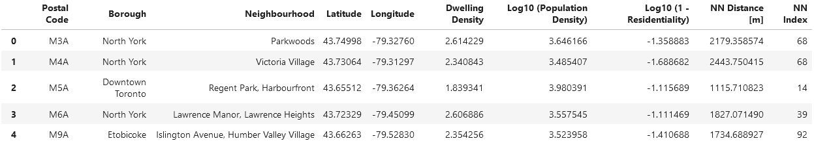

The three census data-derived feature distributions are shown in linear scale (above) and log scale (below) to illustrate the roughly normal distribution of the adjusted features:

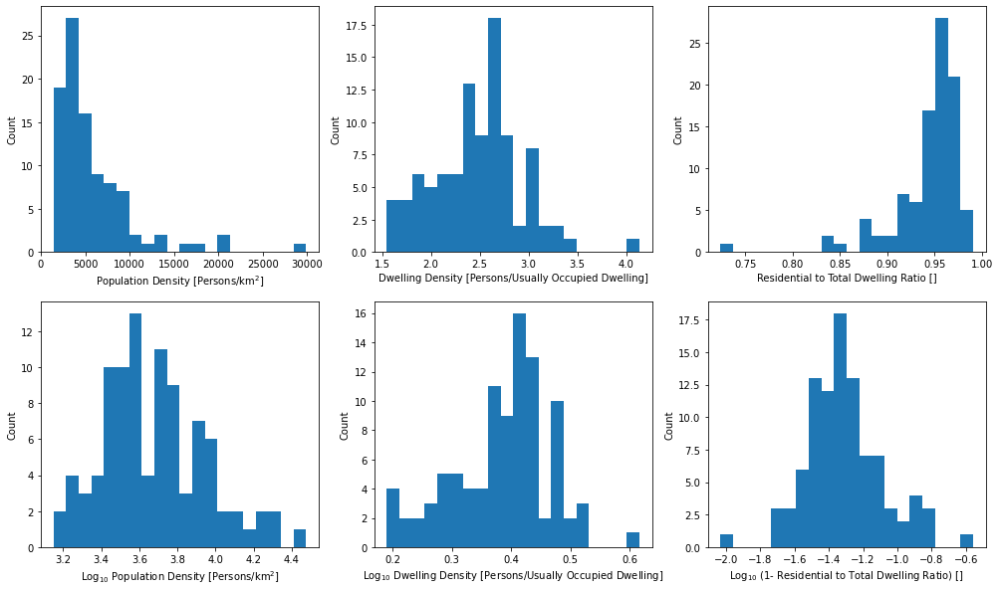

The nearest-neighbor distances distribution indicates some very large FSAs:

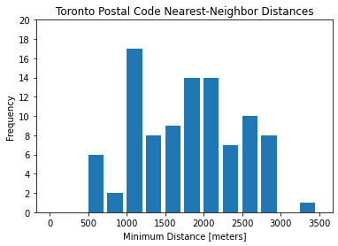

### df_venues

A pandas DataFrame that summarizes venues found in the various areas of Toronto.

Features with additional commentary:
* Radius: Foursquare search radius in meters.  Each venue is initially searched at 500 meters radius, and if the number of venues found is below 50 the radius is increased by 250 meters for each subsequent query until the number of returned venues exceeds 50 or the radius exceeds half the nearest-neighbor distance.
* Category Parents: A list containing all parent categories of the venue category in order starting with the oldest (derived from the [Foursquare category hierarchy](https://developer.foursquare.com/docs/build-with-foursquare/categories/)).
* Category Depth: How many parents belong to the Venue Category (also the length of the Category Parents list)
* Venue Category, Depth _N_: Venue Category limited to _N_ parents; if a venue has _N+1_ or more parents, the parent category at index _N_ is used instead of the Venue Category.

The df_venues DataFrame contains 4069 rows:

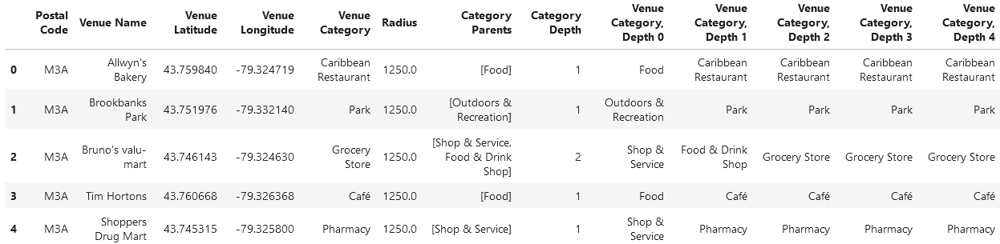

The distribution of number of venues found in each FSA has a fairly wide distribution:

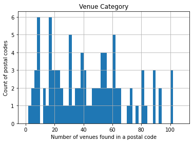

The venue density distribution looks much more normal after taking the logarithm:

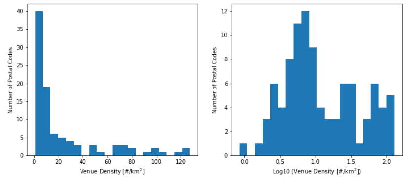

### df_venue_density

A pandas DataFrame that summarizes venue density for each Forward Sortation Area of Toronto.

The density in units of venues per square kilometer is estimated by dividing the number of venues for a given FSA returned in df_venues by the area of a circle with the same radius as the final venue query.

The df_venue_density DataFrame contains 96 rows:

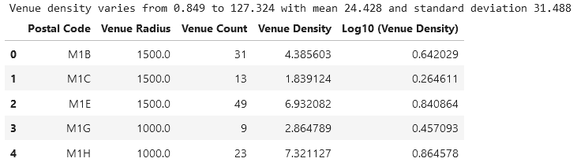

The nearest-neighbor distances are calculated as the smallest distance between geolocation points for each FSA.  These values are used to expand the Foursquare inquiry radius until a threshold number of venues is returned, which prevents 

## K-Means Clustering

K-Means clustering was performed on a variety of combinations of features, including:
* Venue categories only (by one-hot encoding, summation, and L1 normalization of the resulting vector) for each category depth
* Census features only
* Venue density only
* Census features and venue density
* Census features, venue density, and venue categories for each category depth
* Census features, venue density, and venue categories for each category depth with venue category vector scaled so that MSS due to the venue categories matches that for the other features (empirical factor of 1.4); this was the combination selected for final clustering

Various scaling methods were tested including scikit-learn's MinMaxScaler, StandardScaler(), RobustScaler(), and QuantileTransformer, with minimal difference in results.  The MinMaxScaler was used for final analysis.

The elbow method was found to be scaling-dependent and to provide only a qualitative optimization feedback.  This series of plots shows the mean sum of squared distance to centroids for full data sets with differing venue category depths, with optimal cluster number k determined by gap statistic calculation (not shown).  Note the divergence of qualitative elbow position from gap statistic optimum at greater venue depth:

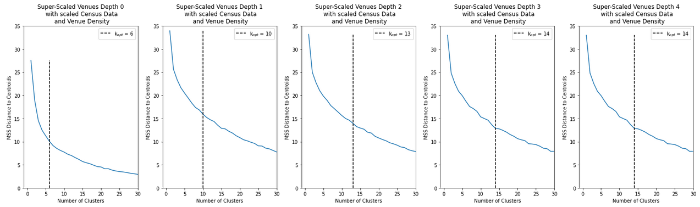

The gap statistic calculates the difference in information content between clustering of the original data and of a uniform reference distribution filling the same phase space bounds as the original data.  It is preferred for optimization since it is quantitative.  Here we use the common selection criterion for optimal cluster number of the gap statistic exceeding one standard deviation below the next-higher gap value.  The optimal cluster number is taken to be 8.

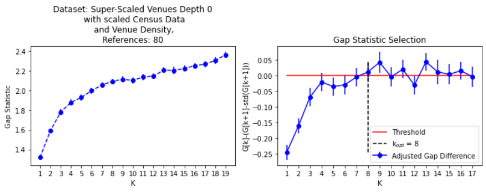

The resulting optimal clusters are summarized here by row with the average value of their features.  Recall that the values for venue features are the fraction of total venues in the FSA in this category, and the values for census feautes and venue density have been rescaled to the interval [0,1].  There is clear differentiation between the clusters:

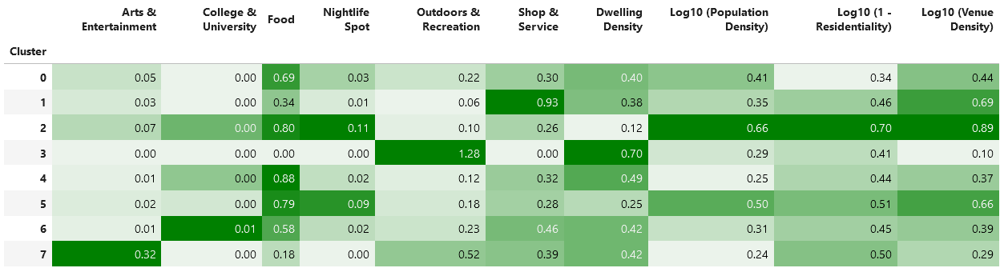

Based on the cluster differentiation, labels are assigned and the results are displayed on a map using Folium with a labeled marker at the centroid of each FSA indicating the cluster index it is assigned to.  In the notebook this map is interactive and the clusters can be toggled and the map zoomed and translated.  This is the final result for this project:

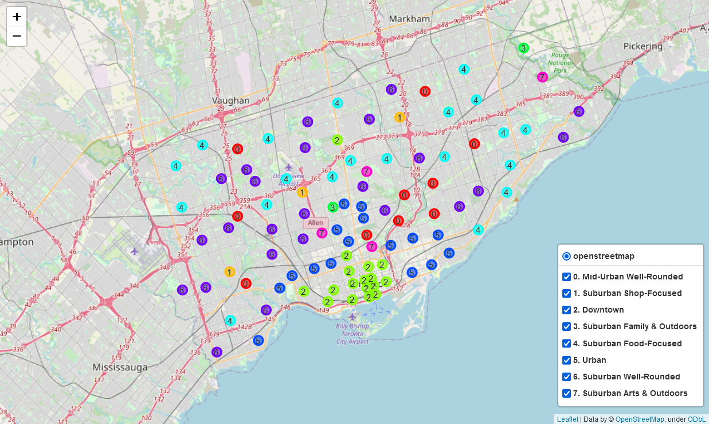

## Notes

BeautifulSoup was initially used for parsing webpages to obtain the table of Toronto FSAs from Wikipedia, however this was abandoned because pandas.read_html() works just as well and was more succinct.

Attempting to geocode a latitude and longitude in a non-commercial environment requires some effort.
Going through some of the list at the geocoder [documentation](https://geocoder.readthedocs.io/):
* geopy.geocoders.google never returned a location in over 200 calls
* geopy.geocoders.canadapost does note return latitude and longitude
* geopy.geocoders.geolytica throws AttributeError: 'dict' object has no attribute 'strip' (see alternate geocoder.ca approach below)
* geopy.geocoders.bing requires an API key
* geopy.geocoders.tomtom requires an API key
* geopy.geocoders.mapquest requires an API key
* geopy.geocoders.mapbox requires an API key
* geopy.geocoders.yahoo returns a KeyError: 'statusDescription'
* geopy.geocoders.ottawa does not return many responses
* geopy.geocoders.Nominatim (osm) gives a reasonable number of responses, was used for initial development, but abandoned due to incomplete returns and high cleaning requirements
* geopy.geocoders.HERE requires an API key, but is free with sufficient quotas and returned values for all requests - this solution was used in this notebook

Venue vector scaling using the MinMaxScaler is a no-op since values range from 0 to 1 initially.  It may be useful to perform an L2 norm scaling for each venue vector, though the effect will likely be small.

An attempt was made to use the toolkit yellowbrick for its KElbowVisualizer, but import errors could not be resolved (though it is expected this has been remedied in subsequent releases).  Also, its elbow optimization algorithm is sensitive to scaling and bounds, and provides no significant benefit over the method developed in this notebook.

Initial development of ANOVA analysis of clustering results was halted when the sklearn.feature_selection.f_classif function was found which provided the same functionality.